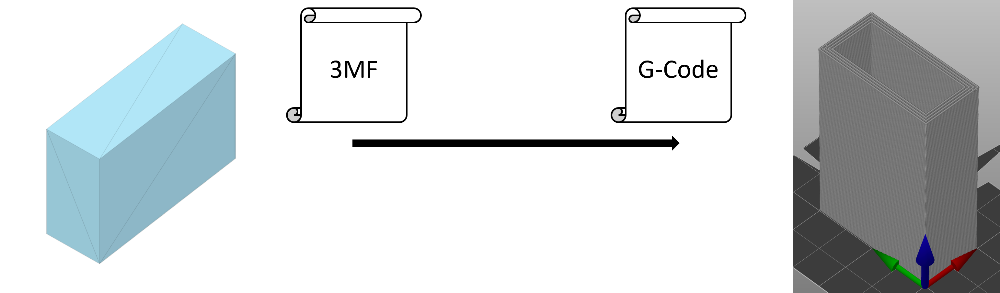
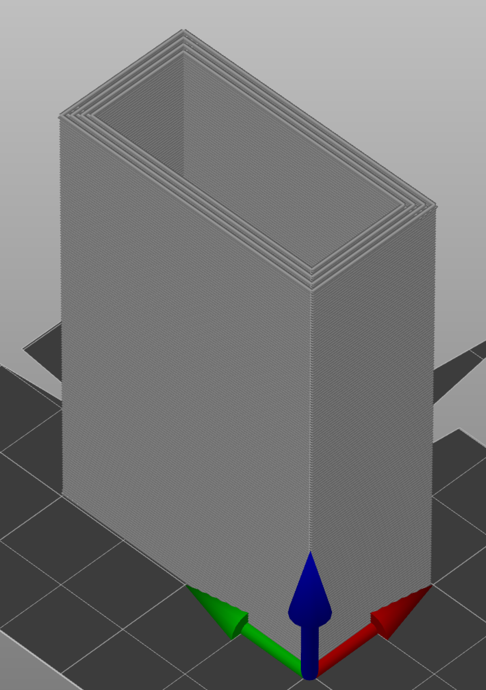
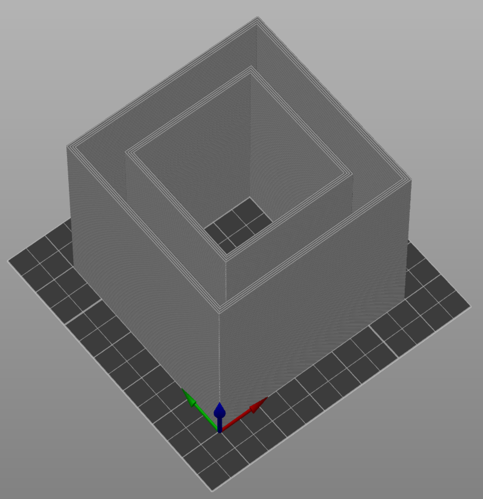
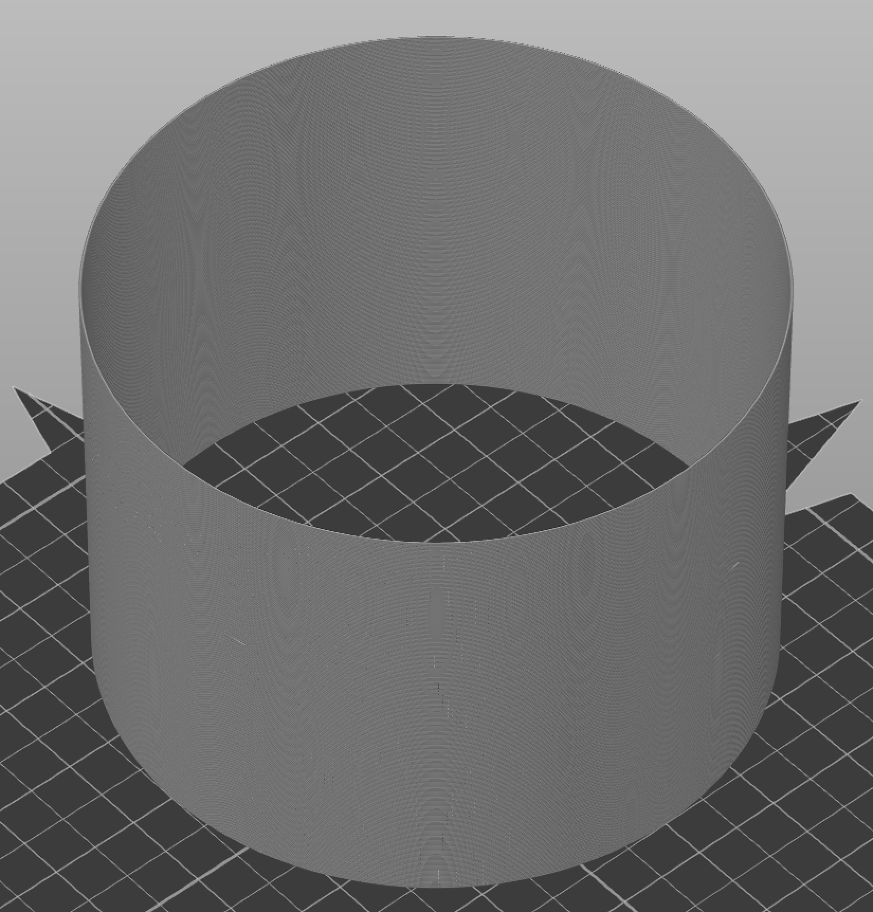

# λslicer

Programmieren eines Slicers für den 3D-Druck




Beispielhafte Programmaufrufe mit Stack:

1. Einfache Box:
    ```haskell
    stack exec -- hslicer-exe -s 0.2 -c 4 -o "./gcodefile.gcode" "./resources/example_3mfs/Box/3D/3dmodel.model" +RTS -N
    ```

    

2. Box mit Loch:
    ```haskell
    stack exec -- hslicer-exe -s 0.2 -c 4 -o "./gcodefile.gcode" "./resources/example_3mfs/Box_Hole/3D/3dmodel.model" +RTS -N
    ```

    

3. Zylinder:
    ```haskell
    stack exec -- hslicer-exe -s 0.2 -c 1 -o "./gcodefile.gcode" "./resources/example_3mfs/Polygon/3D/3dmodel.model" +RTS -N
    ```

    

Time Benchmarking Workflow:

1. Build command: 
    ```haskell
    stack build --ghc-options "-O -threaded -rtsopts"
    ```

2. Time command:
    ```haskell
    stack exec -- hslicer-exe -s 0.2 -c 4 -o "./gcodefile.gcode" "./resources/example_3mfs/Polygon/3D/3dmodel.model" +RTS -N -s 2>&1 | sed -n "/Total/p"
    ```
   Or: Time Benchmark for different cpu core nrs:
    ```haskell
    for f in 1 2 3 4 5 6 7 8; do printf $f; printf ": "; stack exec -- hslicer-exe -s 0.2 -c 4 -o "./gcodefile.gcode" "./resources/example_3mfs/Polygon/3D/3dmodel.model" +RTS -N$f -s 2>&1 | sed -n "/Total/p";done
    ```

Threadscope Workflow:
```haskell
stack build --ghc-options "-O -threaded -rtsopts -eventlog"
stack exec -- hslicer-exe -s 0.2 -c 4 -o "./gcodefile.gcode" "./resources/example_3mfs/Polygon/3D/3dmodel.model" +RTS -N5 -l
```

Co-authored-by: KatjaFrey <KatjaFrey@users.noreply.github.com>