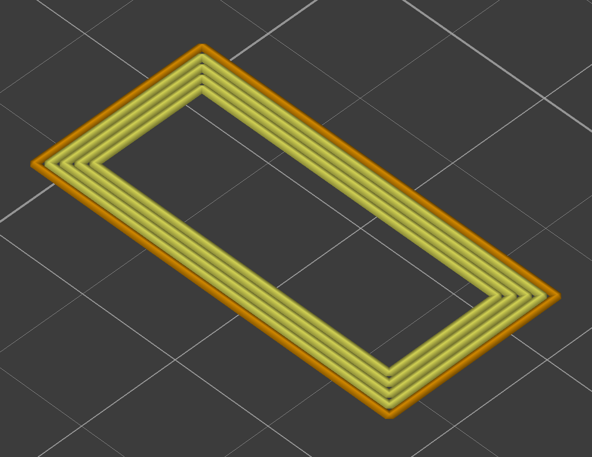

# λslicer

Thema:
Programmieren eines Slicers für den 3D-Druck

Beschreibung:
- Einlesen eines 3D-Körpers/Dreiecks-Mesh, dessen Vektoren, Normalen, und Flächen in einer mit
  XML formatierten Textdatei beschrieben sind.
  Dabei orientieren wir uns am 3MF-Standard des 3MF-Konsortiums: https://3mf.io/
- Generieren von "Slices" aus dem 3D-Körper: 2-Dimensionale Konturen, die den Umriss/die Grenzen des
  3D-Körpers auf der XY-Ebene an einem bestimmten Z-Offset beschreiben.
  Das Z-Offset beginnt bei 0 und steigt für jeden weiteren "Slice" linear mit einer konstanten Schichthöhe an.
- Generieren von raumfüllenden Kurven/Pfaden, die die 2D "Slice"-Konturen ausfüllen.
- Ausgabe dieser 2D-Pfade als Textdatei im "G-Code" Format.

Geplante vertiefende Themen:
- Anwendungsprogrammierung: Verwenden einer XML-Bibliothek zum Parsen der 3MF-Datei
- Parallelität: Das Generieren der "Slices" soll parallelisiert werden
- Funktionale Referenzen (Linsen): Es sollen Datenstrukturen zur Beschreibung des Dreiecks-Mesh und der 2D-Pfade erzeugt werden.
  Verschiedene Berechnungen, die diese Datenstrukturen verändern, sollen Gebrauch von Linsen machen.

In Ordnung, vielleicht kann man ja auch einen Teilparser mit den applikativen Parsern implementieren,
um Applicative als Thema zu demonstrieren.